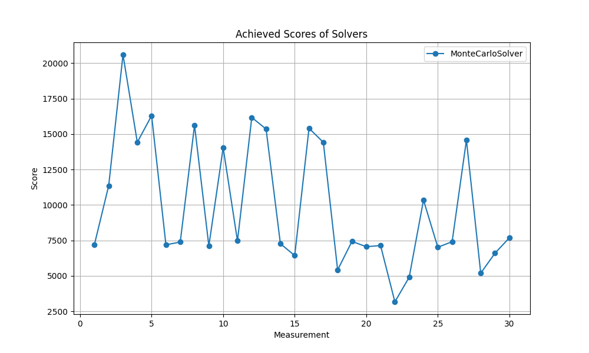
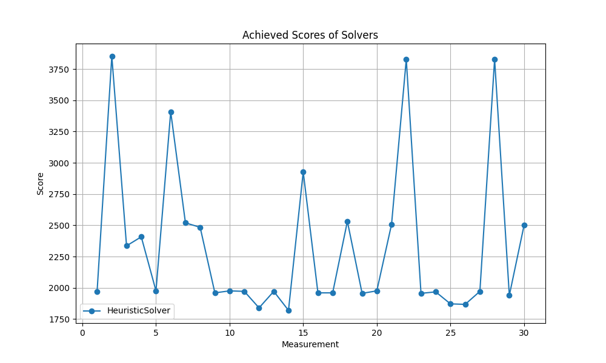

# 2048 Game with solvers
This project is a collection of solvers for the 2048 game. The solvers are implemented in Python and use different strategies to play the game.
#### Author: Filip Hajduch

## Statistics
## RandomSolver Solver Results
- **Number of games:** 30
- **Wins (reaching 2048):** 0/30
- **Best score:** 2464 (game 7)
- **Worst score:** 300 (game 24)
- **Average score:** 888.00
- **Highest tile achieved:** 256 (game 7)
- **Average number of moves per game:** 107.83
- **Total execution time:** 0.07 seconds

### Move Averages:
- **W:** 26.90 moves per game
- **A:** 26.70 moves per game
- **S:** 26.87 moves per game
- **D:** 27.37 moves per game

## MonteCarloSolver Solver Results
- **Number of games:** 30
- **Wins (reaching 2048):** 28/30
- **Best score:** 20592 (game 3)
- **Worst score:** 3164 (game 22)
- **Average score:** 9917.07
- **Highest tile achieved:** 2048 (game 3)
- **Average number of moves per game:** 614.17
- **Total execution time:** 214.71 seconds

### Move Averages:
- **W:** 155.57 moves per game
- **A:** 155.83 moves per game
- **S:** 147.33 moves per game
- **D:** 155.43 moves per game

## HeuristicSolver Solver Results
- **Number of games:** 30
- **Wins (reaching 2048):** 0/30
- **Best score:** 3852 (game 2)
- **Worst score:** 1820 (game 14)
- **Average score:** 2334.93
- **Highest tile achieved:** 256 (game 2)
- **Average number of moves per game:** 219.17
- **Total execution time:** 1.20 seconds

### Move Averages:
- **W:** 117.00 moves per game
- **A:** 100.93 moves per game
- **S:** 0.60 moves per game
- **D:** 0.63 moves per game

