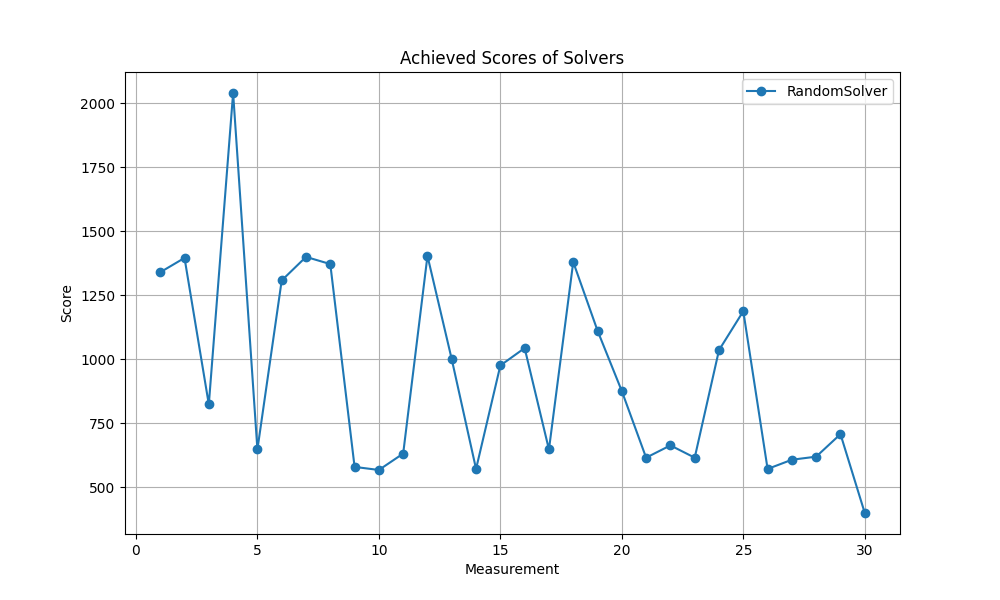
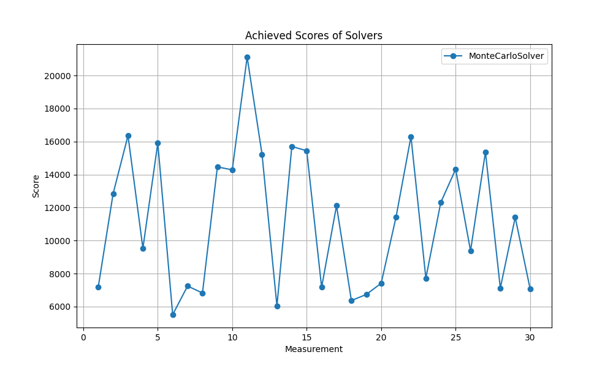
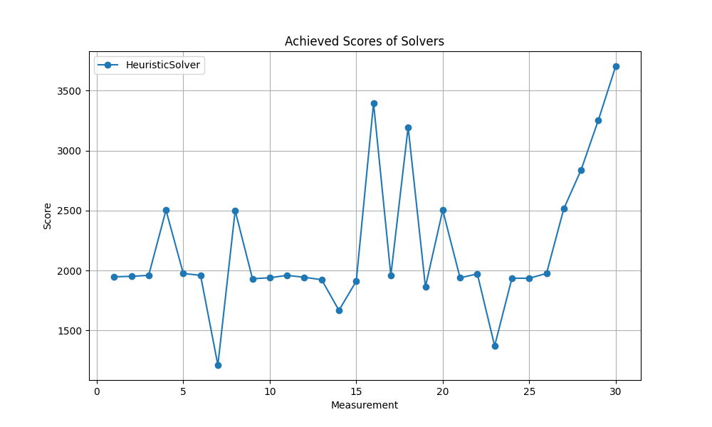
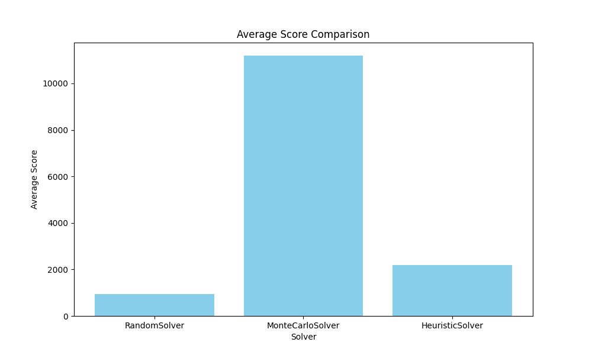
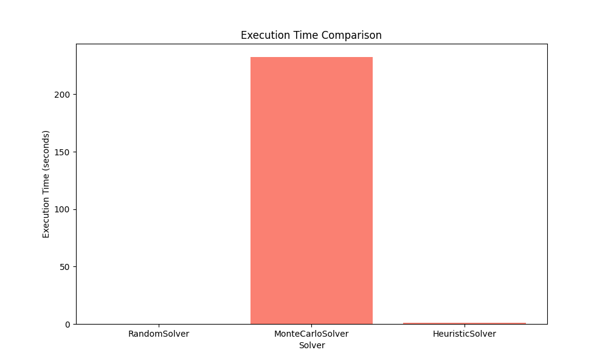
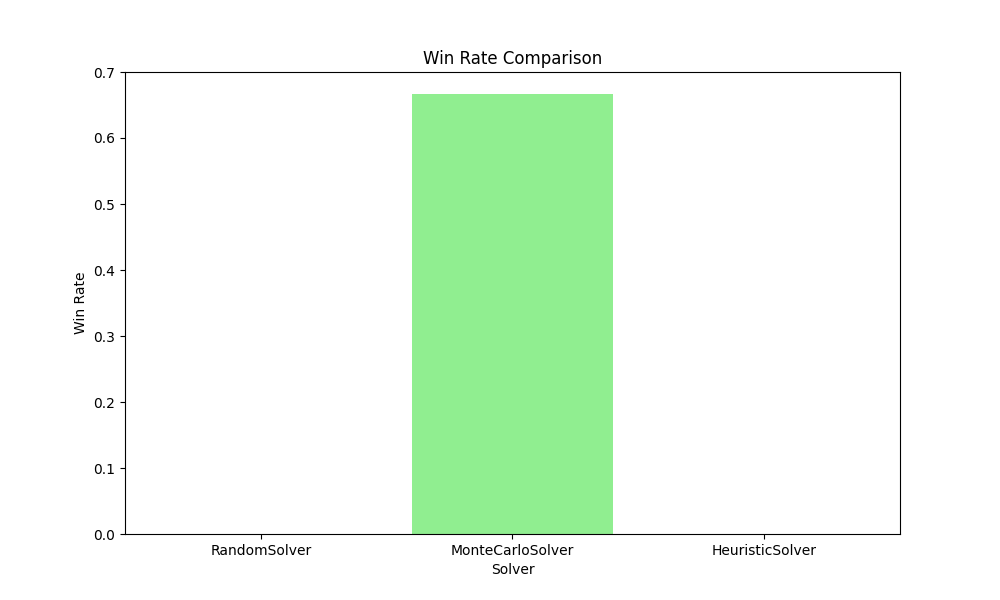

# 2048 Game with solvers
This project is a collection of solvers for the 2048 game. The solvers are implemented in Python and use different strategies to play the game.
#### Author: Filip Hajduch
###### and ChatGPT

## Statistics
- **Number of games:** 30
- **Wins (reaching 2048):** 0/30
- **Best score:** 2632 (game 16)
- **Worst score:** 256 (game 18)
- **Average score:** 1031.07
- **Highest tile achieved:** 256 (game 4)
- **Average number of moves per game:** 117.27
- **Total execution time:** 0.08 seconds

### Move Averages:
- **W:** 28.50 moves per game
- **A:** 30.07 moves per game
- **S:** 30.47 moves per game
- **D:** 28.23 moves per game

## RandomSolver Solver Results
- **Number of games:** 30
- **Wins (reaching 2048):** 0/30
- **Best score:** 2040 (game 4)
- **Worst score:** 400 (game 30)
- **Average score:** 938.27
- **Highest tile achieved:** 256 (game 4)
- **Average number of moves per game:** 112.80
- **Total execution time:** 0.08 seconds

### Move Averages:
- **W:** 28.47 moves per game
- **A:** 30.70 moves per game
- **S:** 26.27 moves per game
- **D:** 27.37 moves per game

## MonteCarloSolver Solver Results
- **Number of games:** 30
- **Wins (reaching 2048):** 20/30
- **Best score:** 21116 (game 11)
- **Worst score:** 5512 (game 6)
- **Average score:** 11195.20
- **Highest tile achieved:** 2048 (game 11)
- **Average number of moves per game:** 672.67
- **Total execution time:** 232.41 seconds

### Move Averages:
- **W:** 168.77 moves per game
- **A:** 169.77 moves per game
- **S:** 168.00 moves per game
- **D:** 166.13 moves per game

## HeuristicSolver Solver Results
- **Number of games:** 30
- **Wins (reaching 2048):** 0/30
- **Best score:** 3704 (game 30)
- **Worst score:** 1212 (game 7)
- **Average score:** 2188.67
- **Highest tile achieved:** 256 (game 4)
- **Average number of moves per game:** 209.67
- **Total execution time:** 1.14 seconds

### Move Averages:
- **W:** 111.53 moves per game
- **A:** 96.67 moves per game
- **S:** 1.00 moves per game
- **D:** 0.47 moves per game

## Graphs

